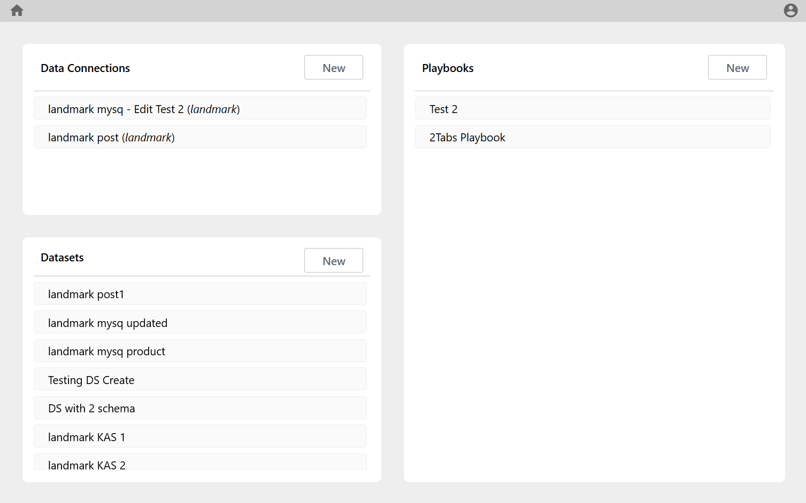
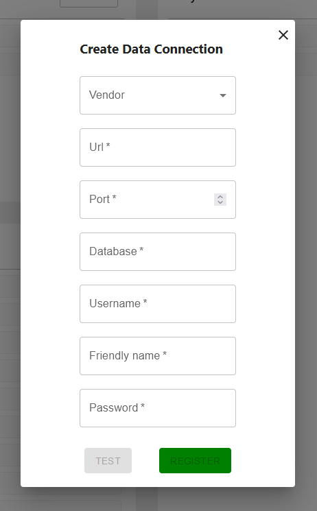
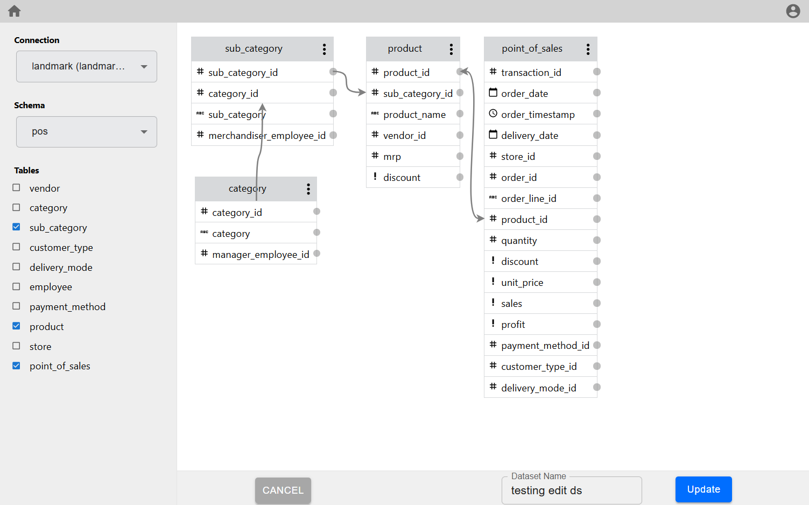

# Silzila - Data Visualization Tool

[Silzila](https://silzila.org/) is an open source tool (License information here) which enables you
to create meaningful visual charts in four easy steps

1. Connect to your Database
2. Define your Dataset
3. Visualize the data
4. Present charts in dashboard

DataConnections and Datasets can be viewed in the home page

Visit [Silzila](https://silzila.org/) website to learn more

## 1. Connect with Database

Create connections to the databases which you need

<!--  -->

## 2. Define your Dataset

Select a subset of tables from one of the Data Connections, define relation between tables and
create a dataset

<!--  -->

## 3. Visualize the data

Visualize the data in one of the many charts available

<!--  -->

## 4. Present charts in dashboard

Charts created in each of the tiles can be then displayed as required in the dashboard

