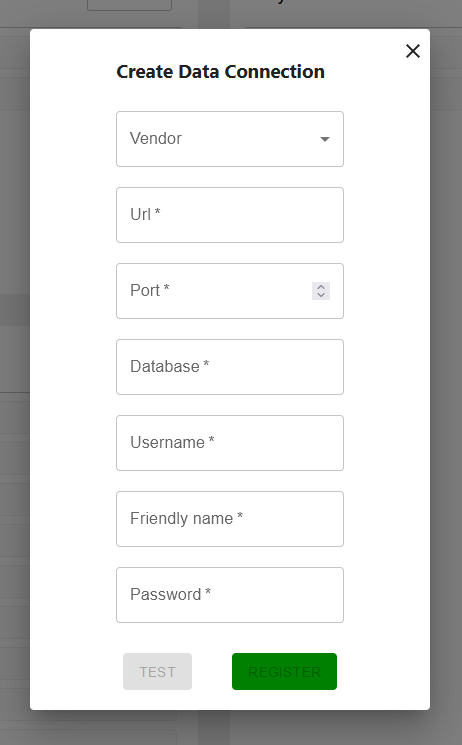
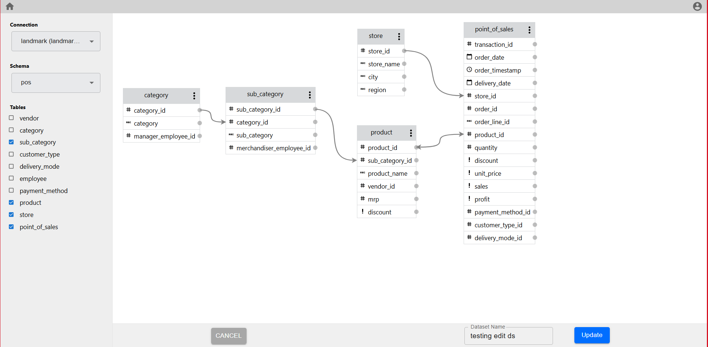
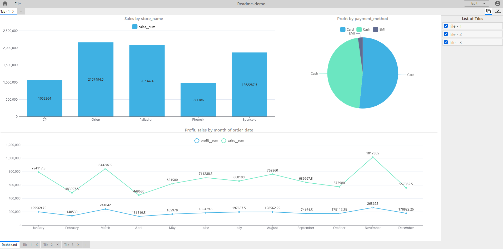

# Silzila - Data Visualization Tool

[Silzila](https://silzila.org/) is an open source tool (License information here) which enables you
to create meaningful visual charts in four easy steps

1. Connect to your Database
2. Define your Dataset
3. Plot the data
4. Present multpile plots in dashboard

Visit [Silzila](https://silzila.org/) website to learn more

## 1. Connect with Database

Create connections to the databases which you need

## 2. Define your Dataset

Select a subset of tables from one of the Data Connections, define relation between tables and
create a dataset

DataConnections and Datasets can be viewed in the home page

## 3. Plot the data

Once a dataset is created, then graphs can be plotted as follows

### Start a new playbook

On the Playbooks list container, click on New button

### Pick a dataset to work with in this playbook

Clicking on new playbooks will open a list of datasets to work with in this playbook

After selecting on a playbook, you will be redirected to the dataViewer page where user can start
creating their plot

### Select a graph type you require

Select one among the many different types of chart that you want to plot

### Select table

Select a table from this dataset. A preview of table will be shown to the right

 

### Drop the fields to be plotted in the dropZone

Drag required table fields from the table preview and drop them into the dropzone.

Once the required fields are dropped within dropzone, the values are computed plotted as a chart

## 4. Present multpile plots in dashboard

Charts created in each of the tiles can be then displayed as required in the dashboard

